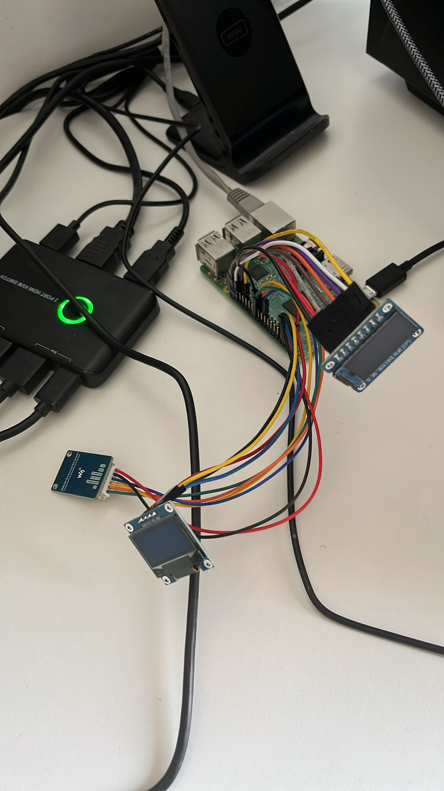
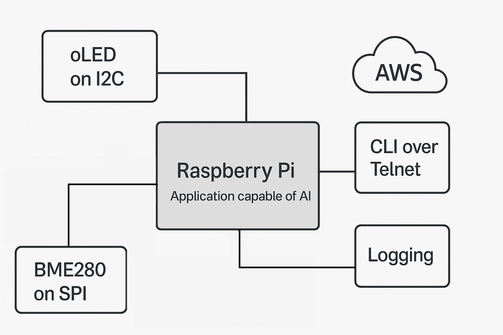

# Raspberry Pi Sensor Node with ML – Kernel & User Space Integration

This repository provides a modular embedded system targeting Raspberry Pi, combining:

- 🧠 **Machine Learning inference in user space**
- 📡 **Custom kernel modules for sensor drivers**
- 🧩 **Modular services with linker set-based registration**
- 🛠️ **Yocto-based SDK for cross-compilation**

---

## 🔧 Hardware Overview



This setup includes various sensors connected to Raspberry Pi via GPIO/I2C/SPI and an OLED display. The system is designed for real-time data acquisition, processing, and control in embedded environments.

---

## 🧠 Application Architecture



- Kernel drivers collect raw sensor data
- User-space application processes and routes data
- CLI, Telnet, Logging, and ML inference modules interact via queues
- Services auto-register via **linker sets**

---

## 📂 Project Structure

```
.
├── KernelSpace/Drivers            # Linux kernel modules for various physical sensors
├── UserSpace/Application          # User space application with various services
└── README.md
```

---

## ⚙️ What are Linker Sets?

**Linker sets** allow components to register themselves dynamically at runtime:

```cpp
REGISTER_AUTO_INIT(CLI)                                            // Register class for startup
CLI_COMMAND_REGISTER_BOTH("loglevel", Logging, setLevel, getLevel) // Register CLI command
REGISTER_QUEUE("TELNET_Q", Queue<>)                                // Register queue
```

This modular design avoids centralized registration, improves scalability, and simplifies extension.

---

## 🧰 Create Yocto SDK

On your Yocto build machine:

```bash
# nano embd_linux/build_pi/conf/local.conf
PACKAGECONFIG:append:pn-gcc-runtime = " static-libstdc++"
DISTRO_FEATURES:append = " staticdev"
SDKIMAGE_FEATURES:append = " staticdev-pkgs"
```
```bash
# cd ~/embd_linux
source poky/oe-init-build-env build_pi
bitbake -c cleansstate gcc-runtime
bitbake gcc-runtime
bitbake core-image-minimal -c populate_sdk
```

This will generate a `.sh` installer:

```bash
# poky-glibc-x86_64-core-image-minimal-cortexa7t2hf-neon-vfpv4-raspberrypi3-toolchain-4.0.21.sh
tmp/deploy/sdk/poky-glibc-x86_64-<sdkname>-armv7at2hf-neon-toolchain-*.sh
```

Then on your dev system:

```bash
# cd tmp/deploy/sdk
chmod +x poky-*.sh
./poky-*.sh
```

Source the environment to use it:

```bash
source /opt/poky/4.0.21/environment-setup-cortexa7t2hf-neon-vfpv4-poky-linux-gnueabi
```

---

## 🧠 Application Architecture


This image outlines the architecture of the user-space application:
- Data flows from kernel drivers into queues
- Services (CLI, Telnet, Logging, etc.) communicate via queues
- ML model is integrated as a self-contained module
- All components register dynamically via linker sets


---

## 🧪 Build User Space Application

```bash
cd UserSpace/Application
mkdir build && cd build
cmake ..
make -j$(nproc)
```

The output binary will be:

```
build/binaries/EmbeddedApp
```

---

## 🧱 Build Kernel Modules

```bash
cd KernelSpace/
source poky/oe-init-build-env build_pi
bitbake virtual/kernel -c devshell
```

---

## 🔄 Deploy with systemd

### Step 1: Move the Binary

```bash
cp build/binaries/EmbeddedApp /home/EmbeddedApp
chmod +x /home/EmbeddedApp
```

### Step 2: Create a systemd Service

```bash
sudo nano /etc/systemd/system/EmbeddedApp.service
```

Paste:

```ini
[Unit]
Description=EmbeddedApp
After=network.target

[Service]
ExecStart=/home/EmbeddedApp
Restart=on-failure
User=root
WorkingDirectory=/home
RestartSec=3
StandardOutput=journal
StandardError=journal

[Install]
WantedBy=multi-user.target
```

### Step 3: Reload and Enable

```bash
[sudo] systemctl enable EmbeddedApp.service
[sudo] systemctl start EmbeddedApp.service
```

### Step 4: Monitor

```bash
systemctl status EmbeddedApp.service
journalctl -u EmbeddedApp.service
```

---

## 📄 License

This project is provided for **educational and reference purposes only**.

> Redistribution, modification, or commercial use is **strictly prohibited** without prior written permission.

© 2025 Kishwar Kumar – All rights reserved.
